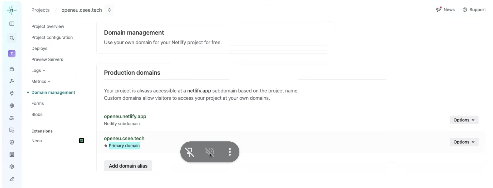

# Deployment

**Author:** `Daniel Bier`

The OpenEU Frontend is deployed on **Netlify**, providing continuous deployment from the GitHub repository with automatic previews for pull requests and deployments from the main branch.

---

## 🚀 Deployment Targets

- [**Netlify**](https://www.netlify.com/) – Primary deployment platform
  - Website: https://openeu.netlify.app
  - Custom domain: https://openeu.csee.tech
  - Automatic deployments from the `main` branch
  - Preview deployments for pull requests


*Screenshot of the Netlify production domain configuration for OpenEU*

---

## 🔑 Environment Variables

The following environment variables are required for the application to function properly:

| Variable | Description |
|----------|-------------|
| `NEXT_PUBLIC_API_URL` | Backend API endpoint URL |
| `NEXT_PUBLIC_SUPABASE_URL` | Supabase project URL | 
| `NEXT_PUBLIC_SUPABASE_ANON_KEY` | Supabase anonymous key for client-side access |

### Setting up Environment Variables

#### Local Development

1. Create a `.env` file in the root directory of the project
2. Add the required variables:
   ```
   NEXT_PUBLIC_SUPABASE_URL="YOUR_SUPABASE_URL"
   NEXT_PUBLIC_SUPABASE_ANON_KEY="YOUR_SUPABASE_ANON_KEY"
   NEXT_PUBLIC_API_URL="URL_TO_BACKEND_API"
   ```

#### Netlify Deployment

1. Navigate to your site settings in the Netlify dashboard
2. Go to **Site settings** → **Environment variables**
3. Add each required variable with its corresponding value
4. Redeploy your site for the changes to take effect

---

## 🔒 Supabase Integration

[Supabase](https://supabase.com/) is used for authentication, database, and storage in the OpenEU Frontend.

### Setting up Supabase

1. Create a Supabase project at [supabase.com](https://supabase.com/)
2. Obtain your project URL and anon key from the API settings
3. Set up database tables and functions as provided in the backend repo

### Authentication Flow

1. The frontend uses Supabase's client library to handle authentication
2. User sessions are managed through Supabase's session management
3. Protected routes check for valid authentication before rendering

---

## 📋 Deployment Process


## 🔄 Continuous Integration/Continuous Deployment (CI/CD)

The project uses GitHub Actions for CI and Netlify for CD:

1. Pull requests trigger lint and type checks via GitHub Actions
2. Netlify deploys preview environments for each PR
3. When merged to main, the Netlify deployment is triggered

---

### Deployment Configuration

The project includes a `next.config.ts` file that configures Next.js for deployment, including:

- Image optimization settings
- Redirects and rewrites
- Static file handling

---

## 🧪 Environment-Specific Considerations

- Deployment uses Netlify environment variables
- Locally you can adjust the environment variables and API endpoints to point to the local instance of the backend and supabase

---

